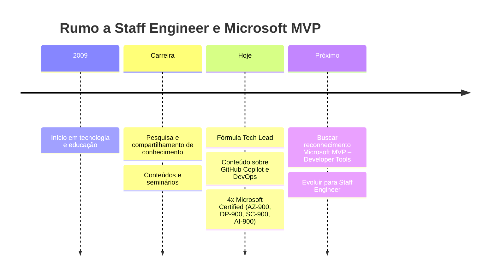

<p align="center">
  
</p>

<p align="center">
  <a href="https://formulatechlead.com.br/">
    
  </a>
</p>

<p align="center">
  
  <a href="https://github.com/brunocaetanobrito?tab=followers"></a>
  
</p>

---

## 👋 Olá, eu sou o Bruno!

Sou **apaixonado por tecnologia e educação desde 2009**. Faço pesquisa, produzo conteúdo e compartilho conhecimento para ajudar desenvolvedores a transformar aprendizado em impacto.

Hoje, meu foco está em **GitHub Copilot, IA generativa e DevOps**, além de formar a próxima geração de **Tech Leads**. Estou construindo minha trajetória rumo a **Staff Engineer** e trabalhando para concorrer a **Microsoft MVP – Developer Tools**, com foco em GitHub Copilot e DevOps.

```yaml
nome: Bruno Caetano de Brito
foco_atual:
  - "🤖 GitHub Copilot & IA no ciclo de desenvolvimento"
  - "⚙️ DevOps, GitHub Actions & Platform Engineering"
  - "🧭 Liderança técnica rumo a Staff Engineer"
missao: "Transformar devs em líderes técnicos que entregam impacto real"
objetivo: "🏆 Microsoft MVP – Developer Tools"
certificacoes:
  - "AZ-900 · Azure Fundamentals"
  - "DP-900 · Azure Data Fundamentals"
  - "SC-900 · Security, Compliance & Identity Fundamentals"
  - "AI-900 · Azure AI Fundamentals"
```

---

## 🏎️ Fórmula Tech Lead

<table>
  <tr>
    <td width="65%">
      <h3>Da linha de código à liderança técnica</h3>
      <p>Conheça o <strong>Fórmula Tech Lead</strong>, meu programa para desenvolver uma liderança que entrega impacto real:</p>
      <ul>
        <li>✅ Liderar times técnicos com confiança</li>
        <li>✅ Tomar decisões de arquitetura e de pessoas</li>
        <li>✅ Usar IA e GitHub Copilot para aumentar a produtividade</li>
        <li>✅ Preparar a carreira para Tech Lead → Staff → Principal</li>
      </ul>
      <a href="https://formulatechlead.com.br/"></a>
    </td>
    <td width="35%" align="center">
      <p>🏁</p>
      <strong>Conhecimento que vira impacto.</strong>
      <p><em>“Tech Lead não é cargo, é responsabilidade.”</em></p>
    </td>
  </tr>
</table>

---

## 🏅 Certificações

<p align="center">
  <a href="https://learn.microsoft.com/pt-br/credentials/certifications/azure-fundamentals/"></a>
  <a href="https://learn.microsoft.com/pt-br/credentials/certifications/azure-data-fundamentals/"></a>
  <a href="https://learn.microsoft.com/pt-br/credentials/certifications/security-compliance-and-identity-fundamentals/"></a>
  <a href="https://learn.microsoft.com/pt-br/credentials/certifications/azure-ai-fundamentals/"></a>
</p>

4x Microsoft Certified — base em Cloud, Dados, Segurança e IA no ecossistema Microsoft 🚀

---

## 📲 Vamos nos conectar?

**Escolha sua rede favorita e acompanhe os próximos conteúdos!**

<p align="center">
  <a href="https://www.youtube.com/@brunocaetanobrito?sub_confirmation=1"></a>
  <a href="https://www.linkedin.com/in/brunocaetanobrito/"></a>
  <a href="https://instagram.com/brunocaetanobrito"></a>
  <a href="https://www.tiktok.com/@brunocaetanobrito"></a>
  <a href="https://www.facebook.com/formulatechlead"></a>
  <a href="https://formulatechlead.com.br/links"></a>
</p>

| Onde | O que você encontra |
|---|---|
| 🎥 **YouTube** | Conteúdos sobre GitHub Copilot, DevOps e carreira |
| 💼 **LinkedIn** | Liderança técnica, aprendizado e trajetória profissional |
| 📸 **Instagram / TikTok** | Dicas rápidas e bastidores |
| 👥 **Facebook** | Conteúdos e novidades do Fórmula Tech Lead |
| 🏎️ **Fórmula Tech Lead** | Meu programa para desenvolver líderes técnicos |
| 🔗 **Links** | Um ponto de partida para explorar meus canais |

---

## 🛠️ Stack & Ferramentas

Tecnologias que conectam desenvolvimento, entrega e liderança técnica:

<p align="center">
  <br><br>
  <br><br>
  
</p>

<p align="center">
  
  
  
</p>

---

## 🧭 Minha jornada



---

## 📊 Estatísticas

<p align="center">
  
  
</p>

<p align="center">
  
</p>

---

## ⭐ Gostou? Me ajude a crescer!

1. ⭐ **[Dê uma estrela nos repositórios que você curtir](https://github.com/brunocaetanobrito?tab=repositories)** — isso ajuda outras pessoas a descobrirem os projetos.
2. 👤 **[Me siga aqui no GitHub](https://github.com/brunocaetanobrito)** para acompanhar os próximos passos.
3. 💡 **Sugira conteúdos ou envie uma pergunta sobre Copilot** — sua dúvida pode inspirar o próximo vídeo, post ou live!

<p align="center">
  <a href="https://github.com/brunocaetanobrito/brunocaetanobrito/issues/new?title=%F0%9F%92%A1+Sugest%C3%A3o+de+conte%C3%BAdo%3A+&amp;body=**Tema%3A**%0A%0A**Por+que+seria+%C3%BAtil%3A**%0A%0A**Formato+(v%C3%ADdeo%2C+post%2C+live)%3A**&amp;template=sugestao-conteudo.yml"></a>
  <a href="https://github.com/brunocaetanobrito/brunocaetanobrito/issues/new?title=%E2%9D%93+Pergunta+sobre+GitHub+Copilot%3A+&amp;template=pergunta-copilot.yml"></a>
</p>

---

<p align="center">
  
</p>

<p align="center">
  <strong>Vamos transformar conhecimento em impacto, juntos.</strong><br>
  
</p>
